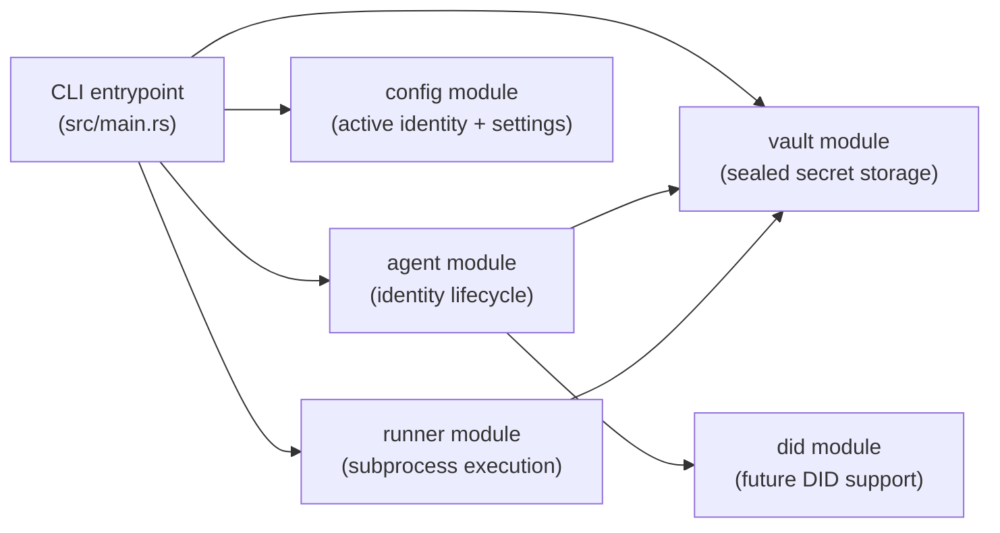

# Overview

Icebox is a local-only macOS CLI credential broker. It injects secrets into trusted subprocesses while keeping encrypted secrets at rest.

## Core Model

1. Register an agent identity.
2. Store sealed secrets per agent in an isolated vault.
3. Run a command with secret injection for a specific service.

## Boundaries

- Icebox controls secret handling in its own process.
- `icebox run` does not make untrusted commands safe; subprocesses can still exfiltrate secrets.
- No outbound network from the `icebox` process in MVP.

## Module Architecture (High-Level)

## Related Docs

- `identity-and-enclave.md`
- `vault-and-integrity.md`
- `secret-management-and-run.md`
- `security-model.md`

---

*Last updated: 2026-02-18*
