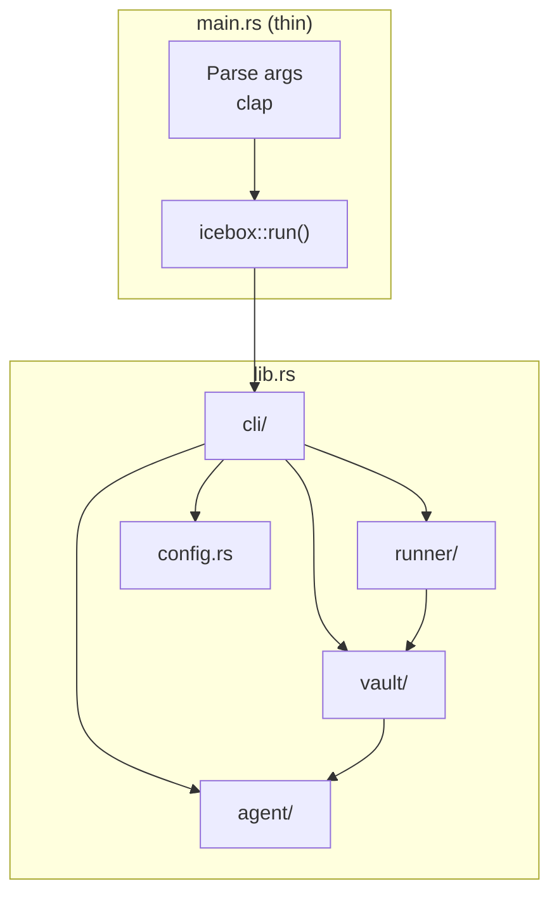
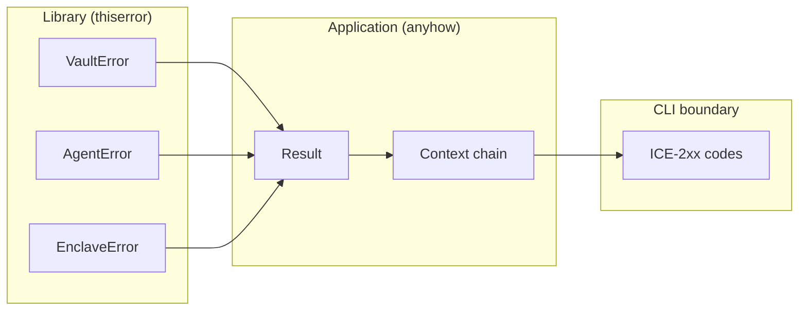
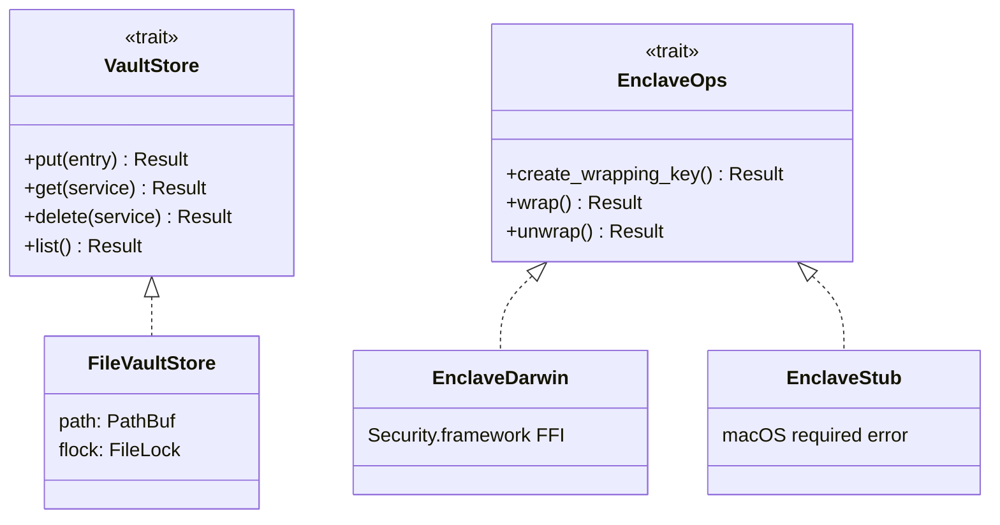
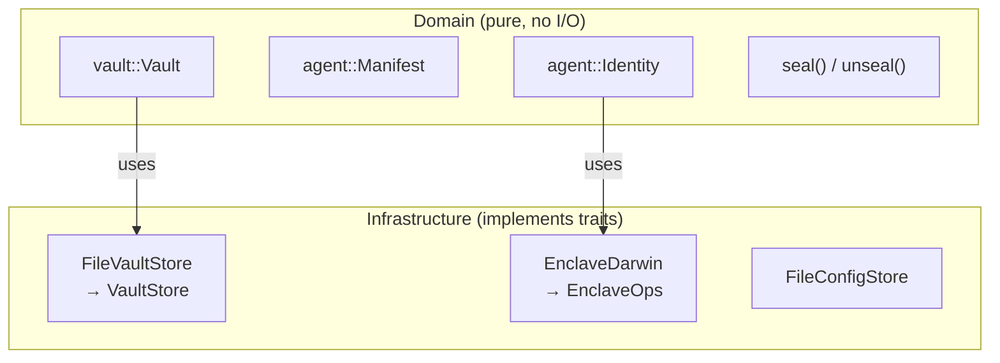
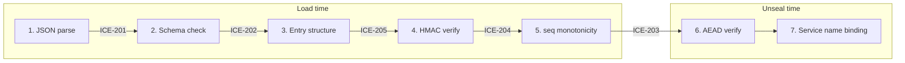
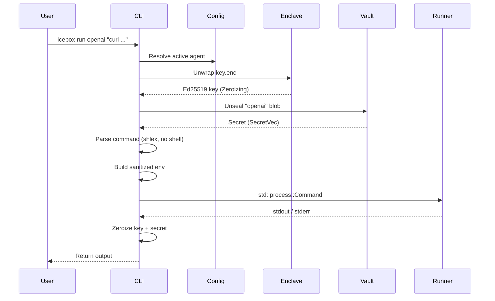

# Icebox — Rust Design & Architecture

> Design patterns and architecture decisions for the Rust implementation. Use this alongside [architecture docs](./) when implementing or converting the codebase.

> **Implementation status (February 15, 2026):** This is a design contract. The Rust source tree described below has not been fully implemented yet.

---

## Project Structure

```
icebox-cli/
├── src/
│   ├── lib.rs              # Public API; re-export only what consumers need
│   ├── main.rs             # Thin binary entry; parse args, delegate to lib
│   ├── error.rs            # Unified error type (thiserror)
│   ├── config.rs           # config.json, agent registry
│   ├── agent/              # Agent identity, keypair, manifest
│   │   ├── mod.rs
│   │   ├── identity.rs
│   │   ├── enclave.rs      # Enclave trait/interface (platform-independent)
│   │   ├── backend_darwin.rs # Secure Enclave backend boundary (macOS only)
│   │   ├── backend_stub.rs # Non-macOS backend stub
│   │   └── did.rs          # did:key derivation (Phase 1.5)
│   ├── vault/              # Sealed-box crypto, vault logic
│   │   ├── mod.rs
│   │   ├── crypto.rs       # X25519, XSalsa20-Poly1305, seal/unseal
│   │   ├── store.rs        # VaultStore trait + FileStore impl
│   │   └── validation.rs  # Vault load validation pipeline (E3-13)
│   ├── runner/             # Secure command execution
│   │   └── mod.rs
│   └── cli/                # clap commands, UX
│       └── mod.rs
├── tests/
├── benches/
└── examples/
```

**Libraries first:** All logic lives in `lib.rs` modules. `main.rs` parses args and calls `icebox::run()`. This enables `cargo test` without spawning a binary and keeps the API testable.



---

## Error Handling

**`thiserror` for library errors** — typed, `#[derive(Error)]`:

```rust
#[derive(Debug, thiserror::Error)]
pub enum VaultError {
    #[error("corrupted vault: {0}")]
    Corrupted(String),
    #[error("integrity check failed")]
    IntegrityFailed(#[from] ICE204),
    #[error("unsupported vault format")]
    UnsupportedFormat(#[from] ICE202),
}
```

**`anyhow` for application layer** — context, `?` propagation:

```rust
fn load_vault(path: &Path) -> anyhow::Result<Vault> {
    let raw = std::fs::read(path)
        .context("failed to read vault file")?;
    Vault::parse(&raw).map_err(Into::into)
}
```

**Error code mapping:** Map internal errors to `ICE-2xx` codes at the CLI boundary. See [Errors & Diagnostics](errors-and-diagnostics.md).



---

## Trait-Based Abstractions

Use Rust traits for abstractions. Traits for anything that has multiple implementations or needs mocking in tests.

### VaultStore

From [Vault & Integrity](vault-and-integrity.md):

```rust
pub trait VaultStore: Send + Sync {
    fn put(&self, entry: VaultEntry) -> Result<()>;
    fn get(&self, service: &str) -> Result<Option<VaultEntry>>;
    fn delete(&self, service: &str) -> Result<()>;
    fn list(&self) -> Result<Vec<String>>;
}

// v1 implementation
pub struct FileVaultStore {
    path: PathBuf,
    flock: FileLock,
}
```

### Enclave (platform-specific)

```rust
#[cfg(target_os = "macos")]
pub trait EnclaveOps: Send + Sync {
    fn create_wrapping_key(&self, agent: &str) -> Result<EnclaveKeyRef>;
    fn wrap(&self, key_ref: &EnclaveKeyRef, plaintext: &[u8]) -> Result<Vec<u8>>;
    fn unwrap(&self, key_ref: &EnclaveKeyRef, ciphertext: &[u8]) -> Result<Vec<u8>>;
}

#[cfg(not(target_os = "macos"))]
pub struct EnclaveStub; // Returns error: "macOS required"
```



---

## Domain vs Infrastructure

**Domain layer** — pure types, no I/O, no `std::fs`:

- `agent::Identity`, `agent::Manifest`
- `vault::Vault`, `vault::SealedBlob`, `vault::VaultEntry`
- `vault::crypto::seal()`, `vault::crypto::unseal()`

**Infrastructure layer** — implements traits, does I/O:

- `vault::FileVaultStore` implements `VaultStore`
- `agent::EnclaveDarwin` implements `EnclaveOps` (via Security.framework FFI)
- `config::FileConfigStore` reads/writes `config.json`



---

## Security-Sensitive Code

| Concern | Crate | Usage |
|---------|-------|-------|
| Secret wiping | `zeroize` | Implement `Zeroize` for key buffers; call `zeroize()` before drop |
| Secret types | `secrecy` | Wrap `Vec<u8>` in `SecretVec` to prevent accidental logging |
| Ed25519 / X25519 | `ed25519-dalek`, `x25519-dalek` | Keypair gen, signing, key agreement |
| Sealed-box | `xsalsa20poly1305` + manual ECDH | Match libsodium `crypto_box_seal` wire format |
| Base58 | `bs58` | did:key encoding (base58btc, no checksum) |

**Memory discipline:** All secret buffers (`PrivateKey`, decrypted blobs) must be:
1. Wrapped in `Zeroizing` or `secrecy::Secret`
2. Zeroed explicitly before drop
3. Never logged, never in `Debug` output

---

## Vault Load Validation Pipeline

Implement the [Vault Load Validation Pipeline](vault-and-integrity.md) as a **single function** in `vault/validation.rs`. Do not scatter checks across the codebase.

```rust
/// Canonical vault load validation. Returns validated Vault or error.
pub fn validate_vault_load(
    raw: &[u8],
    hmac_key: Option<&HmacKey>,
    cached_seq: Option<u64>,
) -> Result<Vault, VaultLoadError> {
    // 1. JSON parse → ICE-201
    // 2. Schema check → ICE-202
    // 3. Entry structure → ICE-205
    // 4. HMAC verification → ICE-204
    // 5. seq monotonicity (rollback) → ICE-203
    // 6–7. AEAD + service binding at unseal time
}
```



---

## CLI

- **`clap`** with derive API for subcommands
- **`tracing`** for structured logging; `--debug` sets `RUST_LOG=icebox=debug`
- **`tracing-subscriber`** with env filter; no logs in default mode

```rust
#[derive(Parser)]
#[command(name = "icebox")]
struct Cli {
    #[arg(long, global = true)]
    debug: bool,
    #[arg(long, global = true)]
    agent: Option<String>,
    #[command(subcommand)]
    command: Commands,
}
```

---

## Testing

- **Unit tests** in same module: `#[cfg(test)] mod tests`
- **Integration tests** in `tests/` — exercise public API only
- **Mock implementations** of `VaultStore`, `EnclaveOps` for tests
- **Temp directories** via `tempfile::tempdir()` for vault/file tests
- **Enclave tests** — use `EnclaveStub` or a test double that returns deterministic blobs

---

## Execution Model

- v1 is a synchronous CLI-first implementation.
- Use `std::process::Command` for `icebox run` subprocess execution (no shell).
- Keep trait interfaces synchronous until a long-lived daemon (`icebox serve`) is introduced.
- Revisit async runtime requirements in Phase 2 when socket serving is added.
- Enforce no outbound network from the `icebox` process in v1; subprocess network behavior is outside this guarantee.

---

## Configuration

- Use direct `serde`-backed file configuration in MVP (`config.rs`), without layered config frameworks.
- **`serde`** for `config.json`, `manifest.json`, vault schema
- **Environment:** `ICEBOX_HOME` overrides `~/.icebox/` (for tests)

---

## Build & Platform

- **`#[cfg(target_os = "macos")]`** for enclave code; stub on other platforms
- **Feature flags:** `enclave` (default on macOS), `did` (Phase 1.5)
- **`fs4`** for `flock` on vault files
- **`nix`** for `statfs` (filesystem check) and `RLIMIT_CORE`

---

## Dependency Summary

| Crate | Purpose |
|-------|---------|
| `clap` | CLI parsing |
| `tracing`, `tracing-subscriber` | Logging |
| `thiserror`, `anyhow` | Errors |
| `serde`, `serde_json` | Config, manifest, vault JSON |
| `ed25519-dalek`, `x25519-dalek` | Crypto |
| `xsalsa20poly1305` | Sealed-box AEAD |
| `bs58` | Base58btc for did:key |
| `zeroize`, `secrecy` | Secret handling |
| `tempfile` | Test temp dirs |
| `fs4` | File locking |
| `nix` | statfs, RLIMIT_CORE |

Security dependency policy:
- Pin security-critical crates (`ed25519-dalek`, `x25519-dalek`, `crypto_box`, `secrecy`, `zeroize`, `security-framework-sys`) for MVP.
- Keep non-security support crates flexible.

---

## Data Flow: `icebox run`




---

*Last updated: 2026-02-18*
