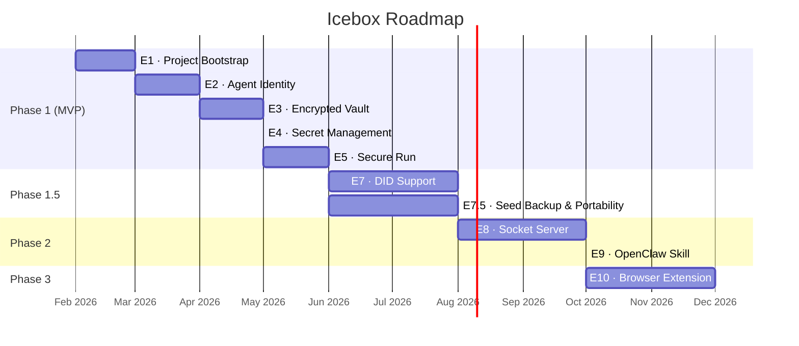

# Icebox Roadmap

> Epics and phases for Icebox CLI. Each epic maps to backlog items in [BACKLOG.md](BACKLOG.md).

---

## Timeline

## Epics

| Code | Epic | Phase | Description |
|---|---|---|---|
| **E1** | Project Bootstrap | 1 (MVP) | Cargo init, CI, CLI scaffolding (clap), project structure |
| **E2** | Agent Identity | 1 (MVP) | Ed25519 keypair generation, multicodec encoding, Secure Enclave wrapping |
| **E3** | Encrypted Vault | 1 (MVP) | `crypto_box_seal` (XSalsa20-Poly1305) vault creation, read/write, in-memory decryption |
| **E4** | Secret Management | 1 (MVP) | `add`, `list`, and `remove` commands for managing secrets |
| **E5** | Secure Run | 1 (MVP) | `run` command -- decrypt, inject, execute, wipe |
| **E6** | Zero-Exposure Hardening | Cross-cutting | Not a standalone phase; items distributed into E1, E2, E3, E5 (built-in from day one) |
| **E7** | DID Support | 1.5 | `did:key` derivation from agent keypair + `did:web` document generation |
| **E7.5** | Seed Backup & Portability | 1.5 | `--seed` flag, BIP39 mnemonic, SLIP-0010 derivation, `recover-agent`, `export`/`import` |
| **E8** | Socket Server | 2 | Brokered execution daemon with policy-gated operations and no long-lived plaintext credential export |
| **E9** | OpenClaw Skill | 2 | OpenClaw skill integration using broker-first capability-scoped operations |
| **E10** | Browser Extension | 3 | Token-based browser login via Icebox-managed credentials |

**Dependency chain (Phase 1 MVP):** E1 → E2 → E3 → E4 → E5 (strictly sequential). E3 requires E2's Ed25519 public key to seal secrets to. E4 requires E3's vault to store entries. E5 requires E4's secret retrieval to inject into subprocesses. E6 is cross-cutting and woven into each epic.

**Phase 1 execution strategy (no scope change):** Deliver a thin vertical slice early (`register-agent` → `add` → `run`) to validate end-to-end architecture and developer workflow, then complete the remaining hardening and edge-case backlog items in the existing epic order. This does not change phases, timelines, or committed features.

**Phase 1 implementation guardrail (no scope change):** Maintain an always-runnable path (`register-agent` → `add` → `run` → `remove`) as a mandatory gate before deeper hardening layers. Hardening is still required for MVP; this guardrail is sequencing-only to prevent complexity from blocking basic behavior.

**Release slicing recommendation (scope unchanged):**
- Build **MVP Core** first as an internal validation slice (`v0.1.0`), then ship **Post-MVP Hardening** immediately after.
- First public GA release is `v0.1.1` once the MVP hardening minimums are complete.
- Deferred hardening details are tracked in implementation planning docs.
- Canonical hardening sequence: [Implementation Bootstrap](IMPLEMENTATION_BOOTSTRAP.md#hardening-layer-order-post-slice).

**Policy boundary sequencing:** Trust-policy/allowlisted command templates are deferred to Phase 2 (`icebox serve` policy layer). MVP documents and warns on trust boundary but does not enforce template policy yet.

**Phase 1.5 prerequisite:** File SLIP-44 registration **now** so it is approved by Phase 1.5. Seed backup (E7.5) uses a custom derivation path (`m/7737'/0'/0'`) until a registered coin type is available.

**Release channel sequencing:** First stable release channel is direct signed/notarized binary. Homebrew bottle distribution follows immediately after first stable release.

**Linux planning status (explicit):**
- Phase 1/1.5 remain macOS-first and enclave-first.
- Linux full-flow support is a post-`v0.1.1` discovery track (earliest in Phase 2 planning), with no committed GA date yet.
- Linux path-model follow-up: evaluate XDG support (`$XDG_CONFIG_HOME`, `$XDG_DATA_HOME`) as part of Linux ergonomics planning.
- Candidate Linux backends to evaluate: TPM-backed wrapping, OS keyring-backed wrapping, software-only dev/CI fallback with reduced guarantees, and external hardware token paths (for example YubiKey via PIV/PKCS#11).

---

*Last updated: 2026-02-24*
