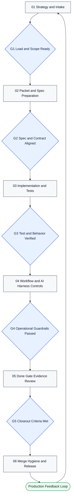

# Enterprise Process Governance

This process framework defines how Icebox enforces enterprise-grade delivery control from intake through release. It is built for traceability, quality gates, and hardening evidence at every transition.

The model is intentionally structured to support a delivery evolution from `CI/CD` to `AI/CD` and eventually `AI/AD`, while preserving clear accountability and auditability.

## Background

Enterprises have relied on **CI/CD** (Continuous Integration / Continuous Delivery) for years to automate builds, tests, and deployments. That foundation is now the springboard for the next shift: AI-augmented and agentic delivery. Teams that have mastered CI/CD are well positioned to adopt **AI/CD** and **AI/AD**, but the transition requires deliberate learning and a phased approach. A practical two-step strategy is: (1) **AI/CD first**—introduce AI coding agents (e.g. Cursor, Copilot, Codex) into existing CI/CD pipelines so agents assist with implementation, tests, and reviews while humans retain approval and release authority; (2) **AI/AD next**—evolve toward autonomous delivery where agents execute more of the lifecycle (spec preparation, workflow changes, release decisions) under policy guardrails, with humans focused on strategy, gates, and exceptions. This progression preserves delivery discipline while increasing agentic execution and policy-backed release confidence.

| Acronym | Meaning | Focus |
|---------|---------|-------|
| **CI/CD** | Continuous Integration / Continuous Delivery | Automated build, test, deploy; human-driven implementation and approval. |
| **AI/CD** | Agentic Integration / Continuous Delivery | AI agents assist implementation, tests, and reviews; humans retain gate and release control. |
| **AI/AD** | Agentic Integration / Autonomous Delivery | Agents execute more of the lifecycle under policy; humans set strategy and handle exceptions. |

## Lifecycle Overview

## Operating Model

- Gate-driven lifecycle with explicit readiness and exit criteria.
- Cross-artifact alignment between roadmap, backlog, specs, tests, architecture decisions, and workflows.
- Evidence-first closeout so "done" means validated, reviewable, and auditable.
- Documentation as a contract surface for both humans and automation.

## Gate and Step Map

| Diagram ID | Type | Name | Purpose | Exit Signal |
|---|---|---|---|---|
| `S1` | Step | Strategy and Intake | Define intent, priority, and scope context. | Work item framed for loading. |
| `G1` | Gate | Load and Scope Ready | Confirm backlog packet quality and execution readiness. | Item is load-approved. |
| `S2` | Step | Packet and Spec Preparation | Align roadmap/backlog/spec/tests/ADR/docs artifacts. | Packet references are complete and reviewable. |
| `G2` | Gate | Spec and Contract Aligned | Ensure behavior and contract definitions are coherent. | Spec/contract alignment accepted. |
| `S3` | Step | Implementation and Tests | Build scoped change with happy-path and failure-path coverage. | Code and tests implemented. |
| `G3` | Gate | Test and Behavior Verified | Validate expected behavior and regressions before hardening. | Test evidence passes for target scope. |
| `S4` | Step | Workflow and AI Harness Controls | Apply workflow, schema, and automation guardrails. | Control checks complete. |
| `G4` | Gate | Operational Guardrails Passed | Confirm hardened automation and policy compliance. | Guardrail evidence accepted. |
| `S5` | Step | Done Gate Evidence Review | Assemble closeout evidence for traceable completion. | Evidence packet assembled. |
| `G5` | Gate | Closeout Criteria Met | Approve transition to done based on hard evidence. | Item state can move to done. |
| `S6` | Step | Merge Hygiene and Release | Enforce merge/commit hygiene and release discipline. | Change is merged and releasable. |
| `O1` | Outcome | Production Feedback Loop | Feed production learnings back into intake. | New cycle begins with updated context. |

## Delivery Evolution

The organization is intentionally moving from classic CI/CD toward agentic and autonomous delivery models. See the [Background](#background) section for definitions and the two-step adoption strategy. This shift preserves delivery discipline while increasing agentic execution, guardrailed autonomy, and policy-backed release confidence.

## System of Record and Platform Options

In this model, Git (plus the repository host) is the chosen process log of record:

- Git history captures code and documentation intent (`what` changed).
- PRs/issues/comments capture decisions and rationale (`why` it changed).
- Workflows and checks capture verification evidence (`how` it was validated).

The same enterprise gating model can be implemented on other platforms, including:

- Jira Software (Atlassian)
- Azure DevOps Boards + Repos + Pipelines
- GitLab Issues + Merge Requests + Milestones
- Linear
- YouTrack
- Rally (Broadcom Agile Central)
- ServiceNow Strategic Portfolio Management / Agile modules
- IBM Engineering Workflow Management (formerly Rational Team Concert)

## Traceability Examples

Use these repository examples as audit-trail references:

- Pull Request examples: [PR #22](https://github.com/torbenanderson/icebox-cli/pull/22), [PR #7](https://github.com/torbenanderson/icebox-cli/pull/7)
- Issue example with multiple comments: [Issue #23](https://github.com/torbenanderson/icebox-cli/issues/23)
- Issue comment evidence:
  - [Issue comment 1](https://github.com/torbenanderson/icebox-cli/issues/23#issuecomment-3948275377)
  - [Issue comment 2](https://github.com/torbenanderson/icebox-cli/issues/23#issuecomment-3948310190)
  - [Issue comment 3](https://github.com/torbenanderson/icebox-cli/issues/23#issuecomment-3948366051)
  - [Issue comment 4](https://github.com/torbenanderson/icebox-cli/issues/23#issuecomment-3948377375)
- GitHub Projects v2 examples: [Project #8](https://github.com/orgs/torbenanderson/projects/8), [Project #6](https://github.com/orgs/torbenanderson/projects/6)
- Milestone example: [Milestone #2](https://github.com/torbenanderson/icebox-cli/milestone/2)

Current repository note: PR review discussion anchors are supported (for example `#discussion_r...`) and should be linked when present; this repo currently uses issue comment trails most heavily for gate evidence.

Best practice: every gate transition should link to at least one immutable artifact (commit, PR, issue comment, workflow run, or release tag) so the delivery chain is independently auditable.

## Process Artifacts

- [Discussion Proposals](DISCUSSION_PROPOSALS.md)
- [Discussion Log](DISCUSSION_LOG.md)
- [Merge Message Template](MERGE_MESSAGE_TEMPLATE.md)

---

*Last updated: 2026-02-24*
