# Enterprise Process Governance

This process framework defines how Icebox enforces enterprise-grade delivery controls from intake through release. It is built for traceability, quality gates, and hardening evidence at every transition.

Icebox is open source, but open source need not lack rigor. Organizations require SDLC, compliance, audit trails, and governance. For a cybersecurity application that brokers credentials and protects secrets, traceable, auditable delivery is essential to trust and quality code.

This framework is a simplified working prototype that could be applied to regulated environments, corporations and enterprises that require safeguards, and may form part of a larger body of work for agentic transformation.

This is a Rewired methodology. The model is intentionally structured to support a delivery evolution from `CI/CD` to `AI/CD` and eventually `AI/AD`, while preserving clear accountability and auditability.

The diagram below illustrates this evolution from the current state (AS-IS) through two target phases (TO-BE).

```mermaid
flowchart LR
  classDef step fill:#F6F8FA,stroke:#2F3B52,stroke-width:1px,color:#0F172A;
  classDef gate fill:#E8F1FF,stroke:#1D4ED8,stroke-width:1.2px,color:#0B1F44;
  classDef done fill:#EAFBF2,stroke:#15803D,stroke-width:1.2px,color:#052E16;

  subgraph ASIS["AS-IS"]
    direction TB
    C0[CI/CD]:::step
    C1[CI: Human-driven]:::step
    C2[CD: Build, test, deploy]:::step
  end
  subgraph TOBE1["TO-BE Phase 1"]
    direction TB
    A0[AI/CD]:::gate
    A1[AI: Agent-assisted]:::gate
    A2[CD: Humans retain gates]:::gate
  end
  subgraph TOBE2["TO-BE Phase 2"]
    direction TB
    D0[AI/AD]:::done
    D1[AI: Agent-autonomous]:::done
    D2[AD: Policy guardrails]:::done
  end
  ASIS --> TOBE1 --> TOBE2
  style ASIS fill:#F6F8FA,stroke:#2F3B52,stroke-width:1px
  style TOBE1 fill:#E8F1FF,stroke:#1D4ED8,stroke-width:1.2px
  style TOBE2 fill:#EAFBF2,stroke:#15803D,stroke-width:1.2px
```

<small>*Figure 1: Delivery Evolution (CI/CD → AI/CD → AI/AD)*</small>

<small>**AI** = Agentic Integration. **AD** = Autonomous Delivery. **AS-IS:** Automation handles build, test, and deploy; humans implement and approve. **TO-BE Phase 1:** AI agents assist with implementation, tests, and reviews; humans retain gate and release control. **TO-BE Phase 2:** Agents execute more of the lifecycle under policy; humans set strategy and handle exceptions.</small>

## Background

Enterprises have relied on **CI/CD** (Continuous Integration / Continuous Delivery) for years to automate builds, tests, and deployments. That foundation is now the springboard for the next shift: AI-augmented and agentic delivery.

Teams that have mastered CI/CD are well positioned to adopt **AI/CD** and **AI/AD**, but the transition requires deliberate learning and a phased approach.

*Example scenario:* I have gone through this phasing myself as CTO at Rewired Consulting.

We started by weaving AI agents into our existing pipelines. Developers used Cursor and Copilot for implementation; agents ran tests and suggested reviews. We kept approval and release control. Six months in, we trusted the setup. We expanded: agents now draft specs, propose workflow changes, and handle routine release decisions—all within policy guardrails. We shifted from gatekeepers to strategists, stepping in only for exceptions.

This progression preserves delivery discipline while increasing agentic execution and policy-backed release confidence.

<small>*AI/CD and AI/AD terminology as used here was introduced by Torben Anderson (Rewired) in February 2026.*</small>

## Lifecycle Overview

The lifecycle is a gate-driven flow from strategy and intake through merge and release. Each step has an explicit gate; work cannot proceed until the gate passes.

Gates act as stage gates and audit points—steering probabilistic AI decisions and output back to quality management best practice defined by the organisation. A different process would be designed for each organisation. Below is the Icebox process.

<small>*Figure 2: Lifecycle Overview (Steps and Gates)*</small>

## Operating Model

The operating model describes how Icebox delivers work: gate-driven, evidence-first, and traceable. It defines the principles that govern the lifecycle and how artifacts stay aligned across roadmap, backlog, specs, tests, and automation.

- Gate-driven lifecycle with explicit readiness and exit criteria.
- Cross-artifact alignment between [roadmap](../plan/ROADMAP.md), [backlog](../plan/BACKLOG.md), [specs](../plan/spec/), [tests](../plan/TESTING.md), [architecture decisions](../architecture/decisions/), and [workflows](../../.github/workflows/).
- Evidence-first closeout so "done" means validated, reviewable, and auditable.
- Documentation as a contract surface for both humans and automation.

## Gate and Step Map

The gate-step map is the reference table for the lifecycle diagram above. Each step (S1–S6) and gate (G1–G5) has a diagram ID, purpose, and exit signal. These steps and gates correspond to **actual skills**—executable checklists and workflows in the [skills](../../skills/) folder that guide load, execute, test, and closeout flows. Use this table to interpret the flowchart and to verify that work has met the criteria before moving to the next stage.

| Diagram ID | Type | Name | Purpose | Exit Signal |
|---|---|---|---|---|
| `S1` | Step | Strategy and Intake | Define intent, priority, and scope context. | Work item framed for loading. |
| `G1` | Gate | Load and Scope Ready | Confirm backlog packet quality and execution readiness. | Item is load-approved. |
| `S2` | Step | Packet and Spec Preparation | Align roadmap/backlog/spec/tests/ADR/docs artifacts. | Packet references are complete and reviewable. |
| `G2` | Gate | Spec and Contract Aligned | Ensure behavior and contract definitions are coherent. | Spec/contract alignment accepted. |
| `S3` | Step | Implementation and Tests | Build scoped change with happy-path and failure-path coverage. | Code and tests implemented. |
| `G3` | Gate | Test and Behavior Verified | Validate expected behavior and regressions before hardening. | Test evidence passes for target scope. |
| `S4` | Step | Workflow and AI Harness Controls | Apply workflow, schema, and automation guardrails. | Control checks complete. |
| `G4` | Gate | Operational Guardrails Passed | Confirm hardened automation and policy compliance. | Guardrail evidence accepted. |
| `S5` | Step | Done Gate Evidence Review | Assemble closeout evidence for traceable completion. | Evidence packet assembled. |
| `G5` | Gate | Closeout Criteria Met | Approve transition to done based on hard evidence. | Item state can move to done. |
| `S6` | Step | Merge Hygiene and Release | Enforce merge/commit hygiene and release discipline. | Change is merged and releasable. |
| `O1` | Outcome | Production Feedback Loop | Feed production learnings back into intake. | New cycle begins with updated context. |

## Delivery Evolution

The organization is intentionally moving from classic CI/CD toward agentic and autonomous delivery models. See the [Background](#background) section for definitions and the two-step adoption strategy. This shift preserves delivery discipline while increasing agentic execution, guardrailed autonomy, and policy-backed release confidence.

## System of Record and Platform Options

In this model, Git (plus the repository host) is the chosen process log of record:

- Git history captures code and documentation intent (`what` changed).
- PRs/issues/comments capture decisions and rationale (`why` it changed).
- Workflows and checks capture verification evidence (`how` it was validated).

The same enterprise gating model can be implemented on other platforms, including:

- Jira Software (Atlassian)
- Azure DevOps Boards + Repos + Pipelines
- GitLab Issues + Merge Requests + Milestones
- Linear
- YouTrack
- Rally (Broadcom Agile Central)
- ServiceNow Strategic Portfolio Management / Agile modules
- IBM Engineering Workflow Management (formerly Rational Team Concert)

## Traceability Examples

Use these repository examples as audit-trail references:

- Pull Request examples: [PR #22](https://github.com/torbenanderson/icebox-cli/pull/22), [PR #7](https://github.com/torbenanderson/icebox-cli/pull/7)
- Issue example with multiple comments: [Issue #23](https://github.com/torbenanderson/icebox-cli/issues/23)
- Issue comment evidence:
  - [Issue comment 1](https://github.com/torbenanderson/icebox-cli/issues/23#issuecomment-3948275377)
  - [Issue comment 2](https://github.com/torbenanderson/icebox-cli/issues/23#issuecomment-3948310190)
  - [Issue comment 3](https://github.com/torbenanderson/icebox-cli/issues/23#issuecomment-3948366051)
  - [Issue comment 4](https://github.com/torbenanderson/icebox-cli/issues/23#issuecomment-3948377375)
- GitHub Projects v2 examples: [Project #8](https://github.com/users/torbenanderson/projects/8), [Project #6](https://github.com/users/torbenanderson/projects/6)
- Milestone example: [Milestone #2](https://github.com/torbenanderson/icebox-cli/milestone/2)

Current repository note: PR review discussion anchors are supported (for example `#discussion_r...`) and should be linked when present; this repo currently uses issue comment trails most heavily for gate evidence.

Best practice: every gate transition should link to at least one immutable artifact (commit, PR, issue comment, workflow run, or release tag) so the delivery chain is independently auditable.

## Process Artifacts

- [Discussion Proposals](DISCUSSION_PROPOSALS.md)
- [Discussion Log](DISCUSSION_LOG.md)
- [Merge Message Template](MERGE_MESSAGE_TEMPLATE.md)

## Glossary

| Term | Definition |
|------|-------------|
| **ADR** | Architecture Decision Record. A document capturing a significant architectural decision and its rationale. |
| **AI/AD** | Agentic Integration / Autonomous Delivery. Agents execute more of the lifecycle under policy; humans set strategy and handle exceptions. |
| **AI/CD** | Agentic Integration / Continuous Delivery. AI agents assist implementation, tests, and reviews; humans retain gate and release control. |
| **CI/CD** | Continuous Integration / Continuous Delivery. Automated build, test, deploy; human-driven implementation and approval. |
| **Gate** | A checkpoint with explicit exit criteria. Work cannot proceed to the next step until the gate passes. |
| **Packet** | An execution packet: a load-approved work item with aligned spec, tests, and contract references. |
| **Spec** | Execution spec. A document defining scope, acceptance criteria, and test mapping for a backlog item. |
| **Step** | A phase in the lifecycle (e.g. Strategy and Intake, Implementation and Tests). |

---

*Last updated: 2026-02-24*
