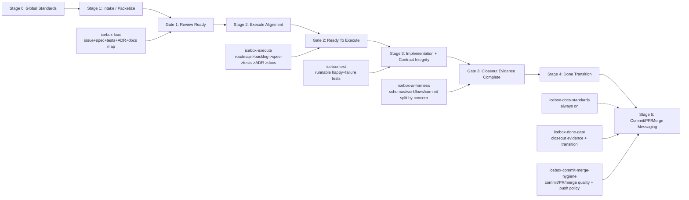

# Skills Index

This directory contains repository-local Codex skills for Icebox workflow control.

## Enterprise Stage-Gate Flow

## Skill Catalog

1. `icebox-docs-standards`
   - Path: `skills/icebox-docs-standards/SKILL.md`
   - Purpose: docs governance across mdBook + rustdoc, nav hygiene, footer policy, publish readiness, and rust source-doc standards.
   - Trigger: every task in this repository.
2. `icebox-load`
   - Path: `skills/icebox-load/SKILL.md`
   - Purpose: prepare backlog work into a reviewable execution packet with canonical issue reference and state machine controls.
   - Trigger: load/prep/stage-for-review requests before coding.
3. `icebox-execute`
   - Path: `skills/icebox-execute/SKILL.md`
   - Purpose: enforce pre-coding alignment gates and execute refusal until packet is truly ready.
   - Trigger: `execute`, start-building, build-component, execute-backlog, kickoff alignment.
4. `icebox-ai-harness`
   - Path: `skills/icebox-ai-harness/SKILL.md`
   - Purpose: schema-contract propagation, workflow guardrails, governance hook, and concern-based commit split guidance.
   - Trigger: schema/examples changes, persisted artifact contract updates, `.github/workflows/*` edits, commit-splitting requests.
5. `icebox-test`
   - Path: `skills/icebox-test/SKILL.md`
   - Purpose: require runnable test artifacts during execute, with at least one happy-path and one failure-path test.
   - Trigger: loaded with `execute` and any request to implement backlog work; can also be invoked standalone via `build tests #<issue-id>` or `build tests E*`.
6. `icebox-done-gate`
   - Path: `skills/icebox-done-gate/SKILL.md`
   - Purpose: hard closeout gate with evidence validation before `in-progress -> done`.
   - Trigger: done/closeout/ship/finish-packet requests.
7. `icebox-commit-merge-hygiene`
   - Path: `skills/icebox-commit-merge-hygiene/SKILL.md`
   - Purpose: standardize commit, PR, and merge message quality with concern-aware structure and push policy.
   - Trigger: commit/PR/merge messaging requests.

## Trigger Shortcuts

1. `icebox-docs-standards`
   - `docs`, `SUMMARY.md`, `footer`, `rustdoc`, `api docs`
2. `icebox-load`
   - `load backlog`, `prepare issue`, `stage for review`, `packetize`
3. `icebox-execute`
   - `execute`, `start building`, `build component`, `kickoff`
4. `icebox-ai-harness`
   - `schema change`, `workflow change`, `contracts`, `split commits by concern`
5. `icebox-test`
   - `execute`, `build tests`, `write tests`, `add happy path and failure path tests`
6. `icebox-done-gate`
   - `done`, `closeout`, `ship this`, `finish packet`
7. `icebox-commit-merge-hygiene`
   - `commit`, `pr`, `pull request`, `merge`, `squash`
## Recommended Skill Order

1. `icebox-docs-standards`
2. `icebox-load`
3. `icebox-execute`
4. `icebox-test`
5. `icebox-ai-harness`
6. `icebox-done-gate`
7. `icebox-commit-merge-hygiene`

## Canonical Execution Path

1. `load E*` or `load #<issue-id>`
2. `fix load #<issue-id>` until review ready
3. `execute #<issue-id>`
4. implement with concern-aware commit split as needed
5. `done #<issue-id>` for closeout evidence + transition
6. commit/PR/merge messaging via hygiene skill

State path:

`draft -> ready-for-review -> ready-to-execute -> in-progress -> done`
